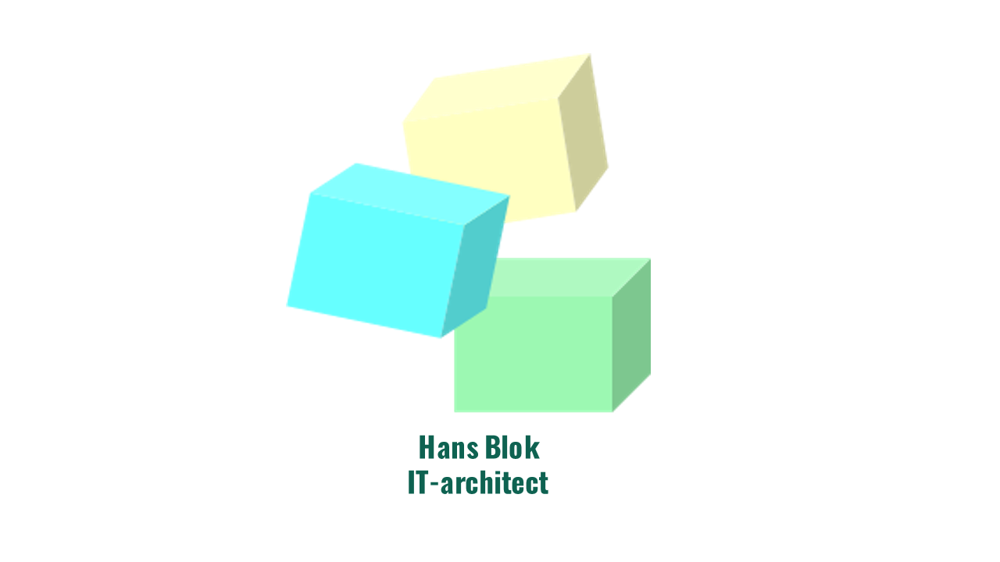

# 2 Minuten IT-Architectuur

## Over de auteur

Ik ben in 1995 afgestudeerd als Algemeen Econoom. Dat merk je misschien wel als we het over IT hebben. Mijn interesse gaat namelijk verder dan technologie alleen: ik kijk graag naar wat IT daadwerkelijk betekent voor organisaties en de samenleving.

In de afgelopen dertig jaar heb ik ons vakgebied van bijna alle kanten mogen bekijken. Ik schreef code in COBOL, werkte veel met Oracle, was Database Administrator, en verdiepte me in testen en informatieanalyse. Sinds 2010 werk ik met veel plezier als IT-architect, waarbij ik organisaties begeleid in hun uitdagende transformaties naar service-georiënteerde IT-landschappen.

De blogs op deze site zijn door mij geschreven als korte essays. Je hebt ze in twee minuten gelezen en ze geven je een persoonlijk inkijkje in hoe IT-architectuur er in de dagelijkse praktijk écht uitziet. Veel leesplezier!

---

## Naar de blogs

- [Nederlands](nl/100-de-it-architect-die-niet-wiebelt.md)
- [English](en/100-the-it-architect-who-doesnt-wobble.md)
