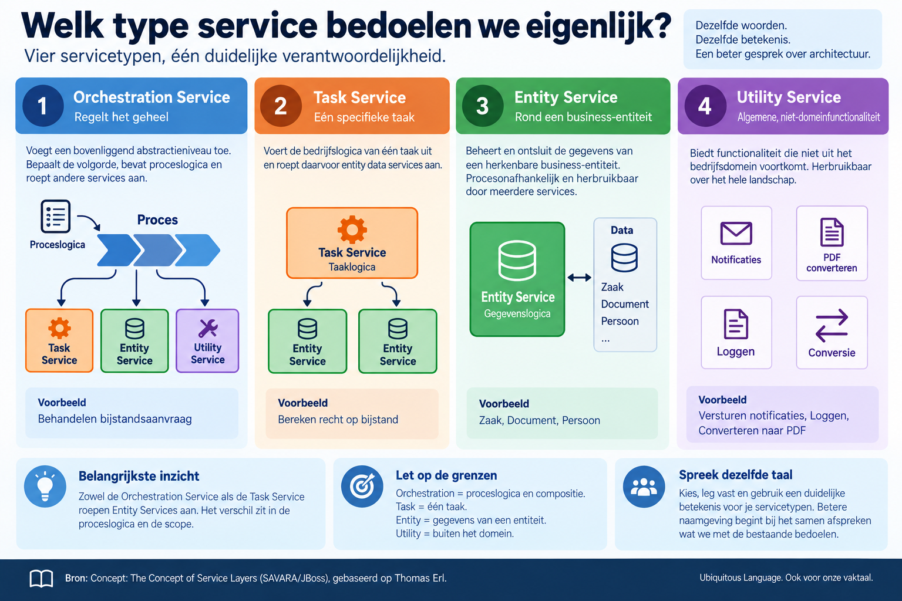

# Welk type service bedoelen we eigenlijk?

**Datum:** 2026-09-18

Binnen een domein streven we naar een Ubiquitous Language: het idee uit Domain-Driven Design dat iedereen dezelfde woorden gebruikt voor dezelfde begrippen. Voor onze eigen vaktaal nemen we die discipline er niet altijd bij. Spreken architecten dezelfde taal als ze het over services hebben?

In architectuurplaten kom ik namen tegen als dataservice, businessservice, API-service, processervice, integratieservice en technische service. Zo'n naam zegt meestal iets over de techniek of over de plek in het landschap, en weinig over de verantwoordelijkheid. Daar komt bij dat verschillende begrippen door elkaar lopen. Een API is het contract waarmee je een service aanroept, geen soort service. Twee architecten kunnen het over dezelfde tekening eens zijn en er iets anders bij denken.

Een beperkte, expliciete indeling van servicetypen helpt dat gesprek vooruit. De SOA-literatuur biedt er een die al twintig jaar meegaat: de service layers die Thomas Erl beschrijft. Niet als formele standaard, en het is ook geen onderdeel van DDD. Wel een bruikbaar vertrekpunt, omdat de vier categorieën over verantwoordelijkheid gaan en niet over techniek.

Een **Orchestration Service** voegt een bovenliggend abstractieniveau toe. Deze service bepaalt de volgorde waarin andere services worden aangeroepen en bevat de scenario-specifieke logica van het proces, zodat de onderliggende services die niet hoeven te kennen. Denk aan Behandelen bijstandsaanvraag.

Een **Entity Service** is georganiseerd rond een herkenbare business-entiteit: Zaak, Document of Persoon. Deze service beheert en ontsluit de gegevens van die entiteit en is procesonafhankelijk. Precies daardoor kan dezelfde Entity Service worden hergebruikt door het bijstandsproces, het vergunningproces en het bezwaarproces.

Een **Task Service** bevat de bedrijfslogica van één specifieke taak, bijvoorbeeld Bereken recht op bijstand of Bereken leges. Dat is iets anders dan orkestratie: een Task Service voert die ene taak uit, terwijl een Orchestration Service meerdere stappen en services in samenhang aanstuurt. Wie de twee door elkaar haalt, bouwt ongemerkt procesvolgorde in een taak in.

Een **Utility Service** biedt functionaliteit die niet uit het bedrijfsdomein voortkomt: versturen van notificaties, loggen, converteren naar PDF. Herbruikbaar over het hele landschap, maar je vindt de logica niet terug in een bedrijfsmodel of zaaktype.

Bij het gebruik van deze indeling past één nuance. De vier worden gepresenteerd als lagen waarin elke service precies één plek heeft, maar de criteria erachter verschillen. Orchestration gaat over compositie en zit boven de rest. Entity en Task zijn twee manieren om de verantwoordelijkheid van businesslogica af te bakenen: rond een entiteit of rond een taak. Utility onderscheidt zich doordat de logica buiten het domein ontstaat. Dat is geen bezwaar, zolang je het benoemt. Doe je dat niet, dan gaan de eerste grensgevallen — is Plan afspraak nu een taak of een entiteit? — over de indeling in plaats van over het ontwerp.

Blijft zo'n indeling uit de SOA-tijd bruikbaar? Voor het doel dat ik hier beschrijf wel. De onderliggende vraag, welke verantwoordelijkheid hoort bij deze service, is niet veranderd sinds we het over microservices en API's zijn gaan hebben. Wat een organisatie ervan overneemt is haar eigen keuze: vier categorieën, drie, of een eigen indeling die beter bij het domein past.

Belangrijker dan welke beperkte classificatie we kiezen, is dat we expliciet afspreken wat onze servicetypen betekenen en dat vastleggen waar architecten het kunnen terugvinden. Betere naamgeving begint niet bij het bedenken van nóg een servicetype, maar bij het samen vaststellen wat we met de bestaande bedoelen.

Bron: [Concept: The Concept of Service Layers](https://docs.jboss.org/savara/methodology/1.0-M1/jboss_soa_plugin/guidances/concepts/concept_service_layers_742015EF.html) (SAVARA/JBoss), gebaseerd op Thomas Erl.
